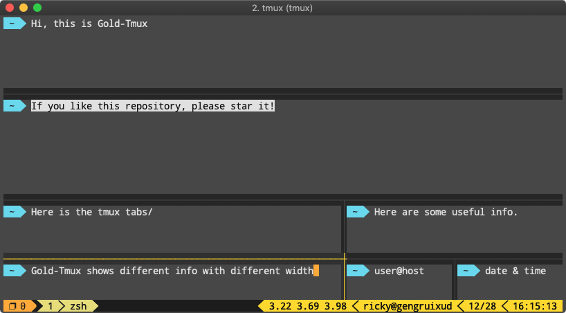
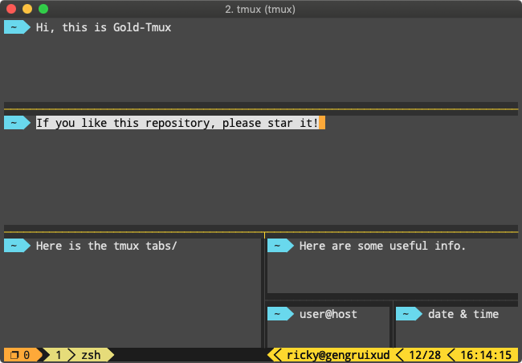
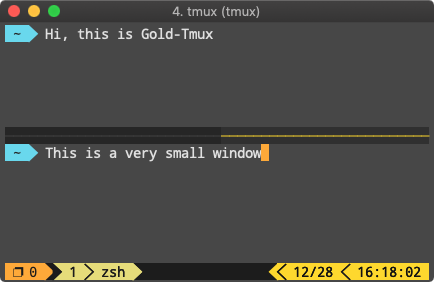

# Gold-Tmux
Just a simple tmux config setting.


## Installation

Via curl:

```shell
sh -c "$(curl -fsSL https://raw.githubusercontent.com/res876ttb/Gold-Tmux/master/install.sh)"
```

Via wget:

```shell
sh -c "$(wget https://raw.githubusercontent.com/res876ttb/Gold-Tmux/master/install.sh -O -)"
```

**NOTE**: The provided one-line installation command will install Gold-Tmux to `~/.Gold-Tmux`. DO NOT remove this directory because the files `~/.tmux.conf` and `~/.tmux.conf.func` are just symbolic links.

## Screenshot






## Shortcut
| Shortcut | Description |
| --- | --- |
| Meta + t | New tab |
| Meta + left/right | Switch to left/right tab |
| Meta + shift + left/right  | Move tab left/right |
| Meta + \\ | Create a horizontal pane |
| Meta + -  | Create a vertical pane |
| Meta + w  | Close current tab |
| Meta + ,/.  | Adjust pane width |
| Meta +  \</\> | Adjust pane height |
| Meta + \[/\]  | Switch to left/right pane |
| Meta + {/}  | Switch to upper/lower pane |
| Meta + 1-9  | Switch to corresponding tab |
